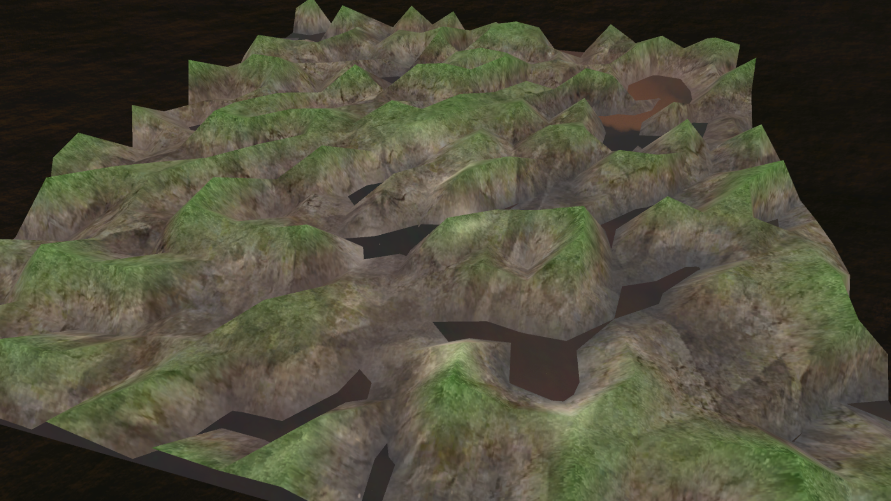
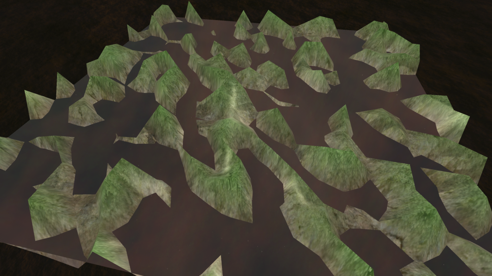

# Procedural Hill with Skybox
A simple Unity3D scene which uses a noise function to generate a hill mesh, and has a "water-like" surface which reflects the skybox. Playable at https://peroshki.github.io/Procedural-Hill-with-Skybox/

All of the shaders and scripts used in this project are included in the Assets foler.

## Controls
| Key        | Action           |
| ------------- |:-------------:|
| Mouse Wheel      | Adjust depth of mesh |
| Space      | Generate new mesh     |

## Screenshots

